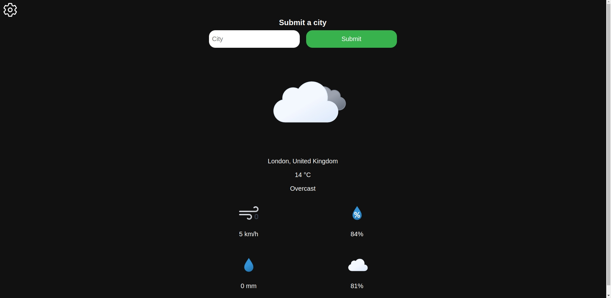

# Weather App in TypeScript



## Description

This TypeScript-based weather application provides a user-friendly interface for obtaining current weather information for a specific city.

## Features

- Search for weather information by entering a city name.
- Conversion to Fahrenheit & MPH when using en-US locale.
- Displays weather information including temperature, wind speed, humidity, precipitation, and cloud cover.

## Technologies Used

- TypeScript
- HTML
- CSS
- [OpenMeteo API](https://open-meteo.com/)

## Getting Started

1. **Clone the repository:**

   ```bash
   git clone https://github.com/yourusername/weather-app-typescript.git
   ```

2. **Install Dependencies:**

   ```bash
   npm install
   ```

3. **Build and Run:**

   ```bash
   npm run dev
   ```

## License

This project is licensed under the [MIT License](LICENSE.txt).
